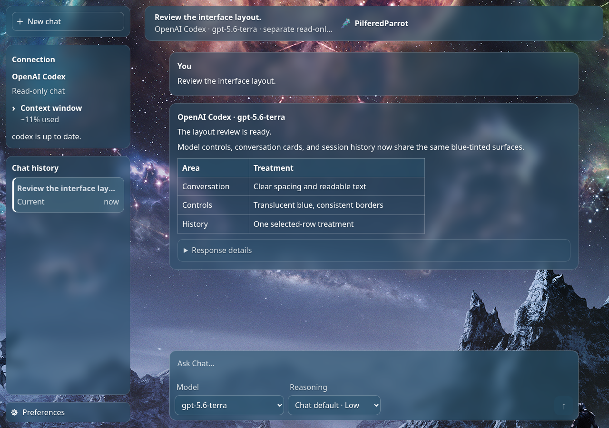

# PilferedParrot Interface

PilferedParrot Interface (PPI) is a local browser interface for coding CLIs and compatible
model APIs. Choose the provider for a work session, keep its project and history together, and
open a separate read-only Chat window when you need a quick question.

**0.7.1** is a reliability and security update for the stable Linux/source channel and unsigned
Windows 10/11 x64 preview. Release assets and completed verification are linked from the
[0.7.1 release](https://github.com/PilferedParrot/PilferedParrot-Interface/releases/tag/v0.7.1);
the [Actions runs](https://github.com/PilferedParrot/PilferedParrot-Interface/actions) show CI results.

[Project site](https://pilferedparrot.github.io/PilferedParrot-Interface/) ·
[Linux 0.7.1 source archive](https://github.com/PilferedParrot/PilferedParrot-Interface/releases/download/v0.7.1/pilferedparrot-0.7.1-source.tar.gz) ·
[0.7.1 release](https://github.com/PilferedParrot/PilferedParrot-Interface/releases/tag/v0.7.1) ·
[Release notes](RELEASE_NOTES.md) ·
[Windows preview ZIP](https://github.com/PilferedParrot/PilferedParrot-Interface/releases/download/v0.7.1/PilferedParrot-0.7.1-windows-x64.zip) ·
[Report a bug](https://github.com/PilferedParrot/PilferedParrot-Interface/issues/new?template=bug_report.yml) ·
[Share feedback](https://github.com/PilferedParrot/PilferedParrot-Interface/issues/new/choose)

Work and Chat now share one transparent, blue-tinted interface: the same headers,
message cards, model/reasoning controls, selected history rows, and spacing.
Appearance choices are saved for the whole app and synchronize across separately
opened windows, including their separate browser profiles.




*Actual Work and Chat interface screenshots with example conversations.*

Open **Preferences → Appearance** ([view the controls](docs/assets/appearance-preferences.png))
to adjust tone, surface weight, and readability. **Darker / Minimal / Standard** is
the shared default for new installations and missing preferences. Existing saved
choices take priority and survive upgrades. Minimal reveals more artwork, while Maximal gives panels more
presence; both retain the same blue-tinted palette. Legacy per-browser appearance
settings are replaced by the shared app setting. Theme artwork keeps its placement
and scale. Linux and Windows include the same interface.

Every fenced code or text block has a **Copy** button, including expanded views,
and copying preserves indentation and blank lines. In Work, **Run with AI** sends
a reviewed shell block to the current session’s provider, reports progress in the
conversation, and preserves your unsent draft. On Linux desktops with Zenity and
a private runtime directory, provider commands can use a desktop sudo password
prompt; an existing `SUDO_ASKPASS` setting takes priority. Passwords pass directly
from the helper to sudo. Terminals, explicit `sudo -n`/`-S`, and provider sandbox
restrictions retain their normal behavior.

Wide tables and preformatted charts keep their top-right fullscreen control.
Close the expanded view with its upper-right button or Escape.

### Usage displays

Work and Chat show all allowance windows reported by Codex, with percentage used,
percentage left, reset times, and freshness. Five-hour and weekly windows depend
on the account and model bucket; unavailable windows are not invented. API-key
billing is separate from ChatGPT included usage. These displays follow
[OpenAI's current usage documentation](https://learn.chatgpt.com/docs/pricing).

Context usage is a next-request estimate. Codex updates it from local usage records
during a response; other providers use their available telemetry or a labelled
local estimate. Refreshing these displays sends no prompts or model requests.
Allowance checks use the supported account endpoint and share a short cache.

## What it does

PPI can run these providers through their local tools or through compatible APIs:

- OpenAI Codex CLI
- Claude Code CLI
- Gemini CLI
- Google Antigravity CLI (Work only at present)
- Local Qwen through an OpenAI-compatible endpoint
- OpenAI-compatible services such as OpenRouter, xAI, Mistral, LM Studio, Ollama, and other endpoints

Work sessions show provider progress, commands, tool results, the selected project folder, and
saved conversation history. Chat runs in its own window and session; it does not receive the work
conversation or route work to another provider.

PPI also includes saved drafts, a local whiteboard, model selection, context estimates, and
desktop notifications. Work executes directly through the provider you choose; the manual
Harness UI has been retired. The existing Harness backend and API remain available for existing
records. See [the Harness review](docs/harness-review.md). Provider access, model availability,
account limits, and usage charges belong to the provider you configure.

The source project requires Python 3.12 or newer. Chrome or Chromium is preferred on Linux; the
Windows preview also detects Microsoft Edge. The Python application has no third-party package
dependencies. Bubblewrap is used for Qwen's Linux shell tools and is disabled on Windows.

## Linux

Linux is the stable, best-validated channel, with strongest validation on Linux Mint with X11.
Install Python 3.12+, Chrome or Chromium, and (if using Qwen shell tools) Bubblewrap.

```bash
git clone --branch v0.7.1 https://github.com/PilferedParrot/PilferedParrot-Interface.git
cd PilferedParrot-Interface
cp config.example.json config.json
./bin/pilferedparrot
```

PPI listens on `http://127.0.0.1:8765` and opens an app-style browser window when it can find
Chrome or Chromium. Open **Providers** to choose an installed and authenticated CLI, or use
**Add provider** for a compatible endpoint. Install local model servers and provider CLIs
separately. PPI stores settings, conversations, and run metadata locally; it does not store API
keys in its provider cards.

To add a menu entry, run `./bin/install-pilferedparrot-desktop` from the checkout. The launcher
points to that directory, so keep it in place. See [provider compatibility](docs/provider-compatibility.md)
for authentication and integration limits.

### Upgrading an existing installation

Download the [0.7.1 source archive](https://github.com/PilferedParrot/PilferedParrot-Interface/releases/download/v0.7.1/pilferedparrot-0.7.1-source.tar.gz),
extract it, and run `./bin/pilferedparrot --version` before replacing your launcher with
`./bin/install-pilferedparrot-desktop`. Keep the extracted directory in place. Existing
configuration, browser profiles, conversations, and run metadata remain in their current local
state directory; do not replace your `config.json` unless you intend to reconfigure the app.

## Windows preview

Download the [0.7.1 Windows x64 preview ZIP](https://github.com/PilferedParrot/PilferedParrot-Interface/releases/download/v0.7.1/PilferedParrot-0.7.1-windows-x64.zip),
extract it to a directory you control, and run `PilferedParrot.exe`. The package includes Python,
needs no installation or administrator rights, and uses Chrome, Chromium, or Microsoft Edge. Keep
the console window open while PPI runs and keep the extracted directory together. The executable
is unsigned; the release includes SHA-256 checksums.

On first launch PPI creates `%LOCALAPPDATA%\PilferedParrot\config.json`. Edit that generated
file for provider settings and keep its `web.chat_store` and `ledger` paths. New projects default
to `%USERPROFILE%\PilferedParrot Projects`. Provider CLIs, Node.js, and local model servers are
separate software. The Windows preview supports browser Chat and file tools; its Unix-only
Bubblewrap shell is disabled, and Windows provider accounts and CLIs are not live-certified.

See [the Windows instructions](packaging/windows/README-WINDOWS.txt) for update and packaging
details. A source checkout can run with Python 3.12+ using `python -m pilferedparrot` or
`PilferedParrot.cmd`.

When updating, close the old copy, extract the new package, run its `PilferedParrot.exe --version`,
and update shortcuts that still point to the old directory. State stays under
`%LOCALAPPDATA%\PilferedParrot`.

## Configuration and security

Choose a project folder before starting work. Qwen file and shell tools are limited to that
project by default; its Linux shell runs without network access unless enabled in local config.
Codex and Claude keep their own authentication, sandbox, approvals, and network behavior. PPI
does not receive provider passwords or manage provider account credentials.

For Codex, `codex.additional_write_dirs` in local `config.json` grants extra roots only when
`codex.sandbox` is `workspace-write`. Paths must exist and be writable by the operator. The list
is unused in `read-only` and `danger-full-access`; leave removable drives out of global roots
unless the task needs them. PPI no longer decides file access from paths mentioned in a prompt.
The selected provider's sandbox and permissions govern actual operations.

For Qwen on Linux, Bubblewrap exposes the selected project and configured additional roots as
persistent write locations, with an ephemeral `/tmp` and only needed system runtime files. Other
host data is hidden by default. Git review runs in a separate read-only, network-disabled sandbox.
When the sandbox cannot see Git metadata, review falls back to changes recorded by Qwen's file
tools; that fallback is narrower than a full Git diff. File-tool diffs recheck resolved paths
before reading, including if a symlink changed after a file was edited. Windows keeps Qwen file
tools but has no Bubblewrap shell.

For the full provider and tool details, read [provider compatibility](docs/provider-compatibility.md),
[whiteboard access and limits](docs/whiteboard.md), and the [Harness review](docs/harness-review.md).

## Development

```bash
PYTHONDONTWRITEBYTECODE=1 python3 -m unittest discover -s tests -v
python3 -m compileall -q pilferedparrot tests
```

See [CONTRIBUTING.md](CONTRIBUTING.md) and [SECURITY.md](SECURITY.md).

## License and support

PPI is available under the [Apache License 2.0](LICENSE). Redistributed copies must preserve the
notices in [NOTICE](NOTICE). If the project is useful to you, you can support development on
[Patreon](https://www.patreon.com/PilferedParrot).

PilferedParrot is developed by PilferedParrot Global Industries, makers of 3D Bumper Billiards.
