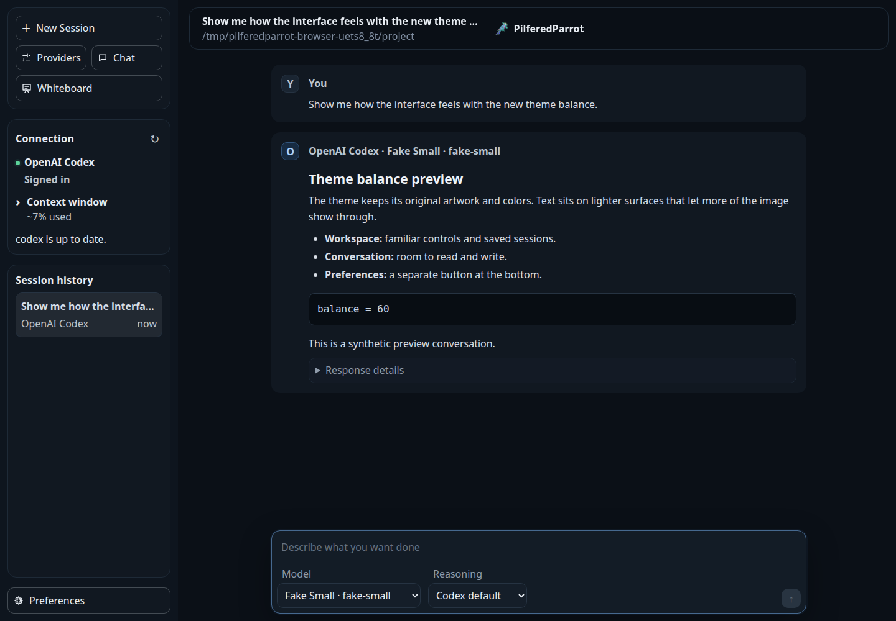

# PilferedParrot Interface

PilferedParrot Interface (PPI) is a local browser interface for coding CLIs and compatible
model APIs. Choose the provider for a work session, keep its project and history together, and
open a separate read-only Chat window when you need a quick question.

The current checkout is the **0.7.0-rc.13 preview**. Linux 0.6.1 remains the stable release;
the Windows 10/11 x64 build is a portable preview. Preview downloads are available from the
[0.7.0-rc.13 release](https://github.com/PilferedParrot/PilferedParrot-Interface/releases/tag/v0.7.0-rc.13).

[Project site](https://pilferedparrot.github.io/PilferedParrot-Interface/) ·
[Linux rc.13 source archive](https://github.com/PilferedParrot/PilferedParrot-Interface/releases/download/v0.7.0-rc.13/pilferedparrot-0.7.0-rc.13-source.tar.gz) ·
[Stable Linux release](https://github.com/PilferedParrot/PilferedParrot-Interface/releases/tag/v0.6.1) ·
[Release notes](RELEASE_NOTES.md) ·
[Windows preview ZIP](https://github.com/PilferedParrot/PilferedParrot-Interface/releases/download/v0.7.0-rc.13/PilferedParrot-0.7.0-rc.13-windows-x64.zip) ·
[Report a bug](https://github.com/PilferedParrot/PilferedParrot-Interface/issues/new?template=bug_report.yml) ·
[Share feedback](https://github.com/PilferedParrot/PilferedParrot-Interface/issues/new/choose)



*Work uses shared spacing, rounded controls, and a quiet sidebar. This preview conversation is synthetic.*

Preview rc.13 gives every imported Chrome theme a 60/100 legibility balance:
more artwork shows through sidebar and conversation surfaces, and color corrections
preserve more of the author's palette. Reading and input surfaces retain stronger
protection. Work and Chat share the treatment, grouped sidebar controls, and a
separate Preferences button that opens a dialog. Linux and Windows share the update.
The Linux/X11 custom title bar stays transparent; the outer Windows title bar
remains drawn by Chrome or Edge.

## What it does

PPI can run these providers through their local tools or through compatible APIs:

- OpenAI Codex CLI
- Claude Code CLI
- Gemini CLI
- Google Antigravity CLI (Work only at present)
- Local Qwen through an OpenAI-compatible endpoint
- OpenAI-compatible services such as OpenRouter, xAI, Mistral, LM Studio, Ollama, and other endpoints

Work sessions show provider progress, commands, tool results, the selected project folder, and
saved conversation history. Chat runs in its own window and session; it does not receive the work
conversation or route work to another provider.

PPI also includes saved drafts, a local whiteboard, model selection, context estimates, and
desktop notifications. Work executes directly through the provider you choose; the manual
Harness UI has been retired. The existing Harness backend and API remain available for existing
records. See [the Harness review](docs/harness-review.md). Provider access, model availability,
account limits, and usage charges belong to the provider you configure.

The source project requires Python 3.12 or newer. Chrome or Chromium is preferred on Linux; the
Windows preview also detects Microsoft Edge. The Python application has no third-party package
dependencies. Bubblewrap is used for Qwen's Linux shell tools and is disabled on Windows.

## Linux

Linux 0.6.1 is the stable, best-validated release, with strongest validation on Linux Mint with
X11. Install Python 3.12+, Chrome or Chromium, and (if using Qwen shell tools) Bubblewrap.

```bash
git clone --branch v0.6.1 https://github.com/PilferedParrot/PilferedParrot-Interface.git
cd PilferedParrot-Interface
cp config.example.json config.json
./bin/pilferedparrot
```

PPI listens on `http://127.0.0.1:8765` and opens an app-style browser window when it can find
Chrome or Chromium. Open **Providers** to choose an installed and authenticated CLI, or use
**Add provider** for a compatible endpoint. Install local model servers and provider CLIs
separately. PPI stores settings, conversations, and run metadata locally; it does not store API
keys in its provider cards.

To add a menu entry, run `./bin/install-pilferedparrot-desktop` from the checkout. The launcher
points to that directory, so keep it in place. See [provider compatibility](docs/provider-compatibility.md)
for authentication and integration limits.

### Upgrading an existing installation

Download the [rc.13 source archive](https://github.com/PilferedParrot/PilferedParrot-Interface/releases/download/v0.7.0-rc.13/pilferedparrot-0.7.0-rc.13-source.tar.gz),
extract it, and run `./bin/pilferedparrot --version` before replacing your launcher with
`./bin/install-pilferedparrot-desktop`. Keep the extracted directory in place. Existing
configuration, browser profiles, conversations, and run metadata remain in their current local
state directory; do not replace your `config.json` unless you intend to reconfigure the app.

## Windows preview

Download the [0.7.0-rc.13 Windows x64 ZIP](https://github.com/PilferedParrot/PilferedParrot-Interface/releases/download/v0.7.0-rc.13/PilferedParrot-0.7.0-rc.13-windows-x64.zip),
extract it to a directory you control, and run `PilferedParrot.exe`. The package includes Python,
needs no installation or administrator rights, and uses Chrome, Chromium, or Microsoft Edge. Keep
the console window open while PPI runs and keep the extracted directory together. The executable
is unsigned; the release includes SHA-256 checksums.

On first launch PPI creates `%LOCALAPPDATA%\PilferedParrot\config.json`. Edit that generated
file for provider settings and keep its `web.chat_store` and `ledger` paths. New projects default
to `%USERPROFILE%\PilferedParrot Projects`. Provider CLIs, Node.js, and local model servers are
separate software. The Windows preview supports browser Chat and file tools; its Unix-only
Bubblewrap shell is disabled, and Windows provider accounts and CLIs are not live-certified.

See [the Windows instructions](packaging/windows/README-WINDOWS.txt) for update and packaging
details. A source checkout can run with Python 3.12+ using `python -m pilferedparrot` or
`PilferedParrot.cmd`.

When updating, close the old copy, extract the new package, run its `PilferedParrot.exe --version`,
and update shortcuts that still point to the old directory. State stays under
`%LOCALAPPDATA%\PilferedParrot`.

## Configuration and security

Choose a project folder before starting work. Qwen file and shell tools are limited to that
project by default; its Linux shell runs without network access unless enabled in local config.
Codex and Claude keep their own authentication, sandbox, approvals, and network behavior. PPI
does not receive provider passwords or manage provider account credentials.

For the full provider and tool details, read [provider compatibility](docs/provider-compatibility.md),
[whiteboard access and limits](docs/whiteboard.md), and the [Harness review](docs/harness-review.md).

## Development

```bash
PYTHONDONTWRITEBYTECODE=1 python3 -m unittest discover -s tests -v
python3 -m compileall -q pilferedparrot tests
```

See [CONTRIBUTING.md](CONTRIBUTING.md) and [SECURITY.md](SECURITY.md).

## License and support

PPI is available under the [Apache License 2.0](LICENSE). Redistributed copies must preserve the
notices in [NOTICE](NOTICE). If the project is useful to you, you can support development on
[Patreon](https://www.patreon.com/PilferedParrot).

PilferedParrot is developed by PilferedParrot Global Industries, makers of 3D Bumper Billiards.
